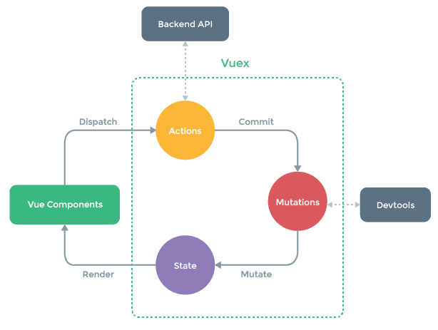

## Vuex

状态管理工具

专门为Vue.js应用程序开发的状态管理模式。

通过Vuex管理的状态仍然是**响应式**的。

是一个全局**单例**对象。

全局单例模式(大管家)

### 什么是状态管理

多个组件需要共享状态，将共享的状态全部存储到一个对象里面进行状态管理。

比如用户的登录状态(token)、地理位置信息等。

比如商品的收藏、购物车中的物品等


只是父子组件，不要把状态往Vuex里面塞。

### Vuex使用

* `npm install vuex --save`
* 创建store(仓库)文件夹，新建index.js

```
import Vue from 'vue'
import Vuex from 'vuex'

// 1.安装插件
Vue.use(Vuex)

// 2.创建对象
const store = new Vuex.Store({
  state: {  //保存状态
    counter:1000
  },
  mutations: {
  
  },
  actions: {
  
  },
  getters: {
  
  },
  modules: {
  
  }
})

//3. 导出store对象
export default store
```

```
// 4.去挂载store
new Vue({
  el:'#app',
  // 和挂载router一样
  store,
  render: h => h(App)
})
```

**可以使用&store拿到这个store对象**

### Vuex的思想



官方不建议通过`&store.state`来直接操作state，因为这样很难**跟踪**到底是谁改了这个状态，**不便于调试**。

Devtools是Vue开发的一个浏览器插件，它实现了这种跟踪。

只有通过Mutations修改，Devtools才能记录。

Mutations里面不推荐使用异步操作，因为Devtools无法跟跟踪异步操作。

当有异步操作时，应该用Actions来做，异步操作完成了再commit到Mutations。

没有异步操作时Actions可以跳过。

异步操作，通常是网络请求。

### 备注

backend：后端

frontend：前端