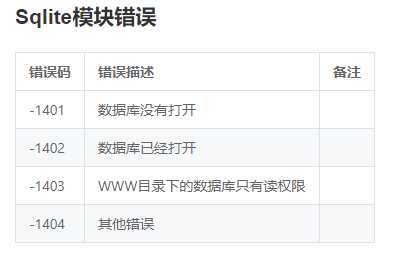

# uni-app

uni-app使用vue的语法+小程序的标签和API

## 创建项目

### 通过HBuilderX可视化界面

HBuilderX内置相关环境，开箱即用，无需配置nodejs。

uni-app自带的模板有 Hello uni-app ，是官方的组件和API示例。

还有一个重要模板是 uni ui项目模板，日常开发推荐使用该模板，已内置大量常用组件。

运行到浏览器—>在浏览器里面体验uni-app 的 **H5** 版

运行的快捷键是`Ctrl+r`。

uni-app默认把项目编译到根目录的**unpackage**目录。

### 通过vue-cli命令行

```
npm install -g @vue/cli
```

**使用正式版**（对应HBuilderX最新正式版）

```
vue create -p dcloudio/uni-preset-vue my-project
```

**使用alpha版**（对应HBuilderX最新alpha版）

```
vue create -p dcloudio/uni-preset-vue#alpha my-alpha-project
```

此时，会提示选择项目模板，初次体验建议选择 `hello uni-app` 项目模板

选择自定义模板时，需要填写 uni-app 模板地址，这个地址其实就是托管在云端的仓库地址。

```
npm run dev:%PLATFORM%
npm run build:%PLATFORM%
```

`%PLATFORM%` 可取值，mp-weixin、h5、app-plus等

app平台生成打包资源（仅支持npm run build:app-plus，也就是**App平台运行调试不支持cli方式**，需在HBuilderX中运行调试）

### 两种方式的区别

#### 编译器的区别

`cli`创建的项目，编译器安装在项目下。并且**不会跟随HBuilderX升级**。如需升级编译器，执行`npm update`。

HBuilderX创建的项目，编译器在HBuilderX的安装目录下的plugin目录，**随着HBuilderX的升级会自动升级**编译器。

将`cli`创建的项目，拖到HBuilderX中。如果是把**整个项目**拖入HBuilderX，则编译时走的是项目下的编译器。如果是把**src目录**拖入到HBuilderX中，则走的是HBuilderX安装目录下plugin目录下的编译器。

#### 开发工具的区别

`cli`创建的项目，**内置**了d.ts

HBuilderX创建的项目不带d.ts，HBuilderX**内置了uni-app语法提示库**。

如需把HBuilderX创建的项目在其他编辑器打开并且补充d.ts，可以在项目下先执行 `npm init`，然后`npm i @types/uni-app -D`，来**补充d.ts**。

vscode等其他开发工具，在vue或uni-app领域，开发效率**比不过**HBuilderX。

发布App时，仍然需要使用HBuilderX。**其他开发工具无法发布App**，但可以发布H5、各种小程序。

### 总结

推荐使用HBuilder

HBuilderX创建的项目，一样可以使用npm

## uni-app由来

既然各巨头无法在标准上达成一致，那么就通过这个框架为开发者抹平各平台差异。

## uni-app官方视频教程笔记

### 当前跨平台开发存在的问题

多端泛滥，Android、IOS、H5多种平台，小程序、快应用多种规范

过去的跨平台框架体验不好，生态不丰富

### uni-app特征

#### 跨平台

一套代码，多端发行

条件编译：在一个项目里调用不同平台的**特色功能**

```
<template>
    <view class="content">
      <!-- #ifdef MP-WEIXIN -->
      <view class="">
          只会编译到小程序
      </view>
      <!-- #endif -->
      
      <!-- #ifdef APP-PLUS -->
      <view class="">
          只会编译到App
      </view>
      <!-- #endif -->
    </view>
</template>
```

#### 运行体验更好

**组件、api与微信小程序一致**，兼容weex原生渲染(nvue)（局部使用weex来提升体验）

#### 通用技术栈

vue的语法、微信小程序的api、**内嵌mpvue**

#### 开放生态，组件更丰富

* 支持通过**npm**安装第三方包
* 支持微信小程序自定义组件及SDK，**支持将微信小程序的SDK和自定义组件在App里面进行使用**
* **兼容mpvue**组件及项目
* App端支持和原生**混合**编码，支持native.js直接调用原生API，支持第三方原生SDK
* 插件市场，支持业内主流的SDK服务商提供的SDK

### 项目目录结构

#### components

> 可复用的组件

#### pages

> 业务页面

#### static

> 静态资源目录，所有的静态文件都应该放置在static目录下

#### App.vue

> 配置全局的事件生命周期，全局的样式(每个页面的公共css)

#### main.js

> 作为Vue的入口文件

#### manifest.json

> app项目的配置中心

#### pages.json

> 记录页面的路由关系，配置导航条、选项卡等等
>
> pages数组中第一项表示应用启动页

### 学习方式

> 模板层(template)、脚本层(script)、样式层(style)

#### 模板层

学习uni-app基础组件，同微信小程序基础组件保持一致。

#### 脚本层

以Vue.js为基础，注意学习一下不支持的部分。Vue.js某些复杂的部分不会在uni-app中使用。

uni-app接口，与微信小程序保持一致。

#### 样式层

CSS3标准规范，推荐使用**flex布局**。

##### 尺寸和单位

`uni-app` 支持的通用 css 单位包括 px、rpx。

px是绝对单位，对应像素。

rpx即响应式px，自适应的动态单位，规定屏幕基准宽度750upx。推荐使用rpx，**upx不再推荐使用**

px、rpx转换

```
设计稿1px/设计稿基准宽度=框架样式1rpx/750rpx
```

**动态绑定style不支持直接使用upx**，**rpx支持动态绑定**

nvue里不支持普通H5单位，不支持百分比单位

rpx不支持动态横竖屏切换计算，使用rpx建议**锁定屏幕方向**

设计师可以用 iPhone6 作为视觉稿的标准。

早期 uni-app 提供了 upx ，目前已经推荐统一改为 rpx 了

## 名词解释

HTML5Plus：跨iOS、Android的JS增强引擎，解决跨端问题，增强JS API，支持跨端。

nvue：native vue的缩写，nvue是weex上补充了uni的JS API，比如uni.request，适合**局部使用**

native.js：将手机操作系统的原生对象转义映射为JS对象，在JS里编写原生代码的这样一个技术，native.js**不跨平台**

uni sdk：有一些sdk对交互性能要求很高，不适合使用JS去运行，比如摄像头的实时滤镜。

mpvue：使用vue.js开发小程序的前端框架，美团开源的

weex：阿里巴巴旗下的跨平台移动开发解决方案，一个使用 Web 开发体验来开发**高性能**原生应用的框架

## 资源路径说明

### template

```
<!-- 绝对路径，/static指根目录下的static目录，在cli项目中/static指src目录下的static目录 -->
<image class="logo" src="/static/logo.png"></image>
<image class="logo" src="@/static/logo.png"></image>
<!-- 相对路径 -->
<image class="logo" src="../../static/logo.png"></image>

@开头的绝对路径以及相对路径会经过base64转换规则校验
引入的静态资源在非h5平台，均不转为base64
H5平台，小于4kb的资源会被转换成base64，其余不转。
```

### JS

```
// 绝对路径，@指向项目根目录，在cli项目中@指向src目录
import add from '@/common/add.js'
// 相对路径
import add from '../../common/add.js'

js文件不支持使用/开头的方式引入
```

### CSS

```
/* 绝对路径 */
@import url('/common/uni.css');
@import url('@/common/uni.css');
/* 相对路径 */
@import url('../../common/uni.css');
@import "../../common/uni.css";

/* 绝对路径 */
background-image: url(/static/logo.png);
background-image: url(@/static/logo.png);
/* 相对路径 */
background-image: url(../../static/logo.png);

@开头的绝对路径以及相对路径会经过base64转换规则校验
用;表示语句结束
```

## 生命周期

### 应用生命周期

| 函数名            | 说明                                                         |
| :---------------- | :----------------------------------------------------------- |
| onLaunch          | 当`uni-app` 初始化完成时触发（**全局只触发一次**）           |
| onShow            | 当 `uni-app` 启动，或从后台进入前台显示                      |
| onHide            | 当 `uni-app` 从前台进入后台                                  |
| onError           | 当 `uni-app` 报错时触发                                      |
| onUniNViewMessage | 对 `nvue` 页面发送的数据进行监听，可参考 [nvue 向 vue 通讯](https://uniapp.dcloud.io/use-weex?id=nvue-向-vue-通讯) |

* 应用生命周期仅可在`App.vue`中监听，在其它页面监听无效

### 页面生命周期

| 函数名                              | 说明                                                         |
| :---------------------------------- | :----------------------------------------------------------- |
| onLoad                              | 监听页面加载，其参数为上个页面传递的数据，参数类型为Object（用于页面传参），参考[示例](https://uniapp.dcloud.io/api/router?id=navigateto)，url有长度限制 |
| onShow                              | 监听页面显示。页面每次出现在屏幕上都触发，包括从下级页面点返回露出当前页面 |
| onReady                             | 监听页面初次渲染完成。**注意如果渲染速度快，会在页面进入动画完成前触发** |
| onHide                              | 监听页面隐藏                                                 |
| onUnload                            | 监听页面卸载                                                 |
| onResize                            | 监听窗口尺寸变化                                             |
| onPullDownRefresh                   | 监听用户**下拉**动作，一般用于下拉刷新，参考[示例](https://uniapp.dcloud.io/api/ui/pulldown) |
| onReachBottom                       | 页面**上拉触底**事件的处理函数                               |
| onTabItemTap                        | 点击 tab 时触发，参数为Object。**微信小程序**、百度小程序、H5、**App（自定义组件模式）**。 |
| onShareAppMessage                   | 用户点击右上角分享。**微信小程序**、百度小程序、字节跳动小程序、支付宝小程序。 |
| onPageScroll                        | 监听页面滚动，参数为Object。                                 |
| onNavigationBarButtonTap            | 监听**原生标题栏按钮**点击事件，参数为Object                 |
| onBackPress                         | 监听页面返回，返回 event = {from:backbutton、 navigateBack} ，backbutton 表示来源是左上角返回按钮或 android 返回键；navigateBack表示来源是 uni.navigateBack ；详细说明及使用：[onBackPress 详解](http://ask.dcloud.net.cn/article/35120) |
| onNavigationBarSearchInputChanged   | 监听**原生**标题栏搜索输入框输入内容**变化**事件             |
| onNavigationBarSearchInputConfirmed | 监听**原生**标题栏搜索输入框**搜索**事件，用户点击**软键盘**上的“搜索”按钮时触发。 |
| onNavigationBarSearchInputClicked   | 监听**原生**标题栏搜索输入框**点击**事件                     |

`onPageScroll` 参数说明：

| 属性      | 类型   | 说明                                 |
| --------- | ------ | ------------------------------------ |
| scrollTop | Number | 页面在垂直方向已滚动的距离（单位px） |

**备注**：onTabItemTap，tab是指什么。

## 路由

### 路由跳转

`uni-app` 有**两种**页面路由跳转方式：使用[navigator](https://uniapp.dcloud.io/component/navigator)组件跳转、调用[API](https://uniapp.dcloud.io/api/router)跳转。

### 页面栈

框架以 **栈** 的形式管理当前所有页面， 当发生路由切换的时候，页面栈的表现如下：

| 路由方式   | 页面栈表现                        | 触发时机                                                     |
| ---------- | --------------------------------- | ------------------------------------------------------------ |
| 初始化     | 新页面入栈                        | uni-app 打开的第一个页面                                     |
| 打开新页面 | 新页面入栈                        | 调用 API  [uni.navigateTo](https://uniapp.dcloud.io/api/router?id=navigateto) 、使用组件[`<navigator open-type="navigate"/>`](https://uniapp.dcloud.io/component/navigator?id=navigator) |
| 页面重定向 | 当前页面出栈，新页面入栈          | 调用 API  [uni.redirectTo](https://uniapp.dcloud.io/api/router?id=redirectto) 、使用组件 [`<navigator open-type="redirectTo"/>`](https://uniapp.dcloud.io/component/navigator?id=navigator) |
| 页面返回   | 页面不断出栈，直到目标返回页      | 调用 API  [uni.navigateBack](https://uniapp.dcloud.io/api/router?id=navigateback)  、使用组件 [`<navigator open-type="navigateBack"/>`](https://uniapp.dcloud.io/component/navigator?id=navigator) 、用户按左上角返回按钮、安卓用户点击物理back按键 |
| Tab 切换   | 页面全部出栈，只留下新的 Tab 页面 | 调用 API  [uni.switchTab](https://uniapp.dcloud.io/api/router?id=switchtab) 、使用组件 [`<navigator open-type="switchTab"/>`](https://uniapp.dcloud.io/component/navigator?id=navigator) 、用户切换 Tab |
| 重加载     | 页面全部出栈，只留下新的页面      | 调用 API  [uni.reLaunch](https://uniapp.dcloud.io/api/router?id=relaunch) 、使用组件  [`<navigator open-type="reLaunch"/>`](https://uniapp.dcloud.io/component/navigator?id=navigator) |

备注：Tab是指什么

## 运行环境判断

### 开发环境和生产环境

`process.env.NODE_ENV`，一般用于连接测试服务器或生产服务器的动态切换。

`process.env.NODE_ENV === 'development'`为开发环境

在HBuilderX 中，点击“运行”编译出来的代码是开发环境，点击“发行”编译出来的代码是生产环境

### 判断平台

平台判断有2种场景，一种是在编译期判断，一种是在运行期判断。

* 编译期判断，即条件编译

* 运行期判断是指代码已经打入包中，仍然需要在运行期判断平台

  使用 `uni.getSystemInfoSync().platform` 判断客户端环境是 Android、iOS 还是小程序开发工具

## 使用Vue.js注意事项

### 事件处理器

```
// 事件映射表，左侧为 WEB 事件，右侧为 ``uni-app`` 对应事件
{
    click: 'tap',
    touchstart: 'touchstart',
    touchmove: 'touchmove',
    touchcancel: 'touchcancel',
    touchend: 'touchend',
    tap: 'tap',
    longtap: 'longtap', //推荐使用longpress代替
    input: 'input',
    change: 'change',
    submit: 'submit',
    blur: 'blur',
    focus: 'focus',
    reset: 'reset',
    confirm: 'confirm',
    columnchange: 'columnchange',
    linechange: 'linechange',
    error: 'error',
    scrolltoupper: 'scrolltoupper',
    scrolltolower: 'scrolltolower',
    scroll: 'scroll'
}
```

事件修饰符

- `.stop`：各平台均支持， 使用时会阻止事件冒泡，在非 H5 端同时也会阻止事件的默认行为
- `.prevent` 仅在 H5 平台支持
- `.self`：仅在 H5 平台支持
- `.once`：仅在 H5 平台支持
- `.capture`：仅在 H5 平台支持
- `.passive`：仅在 H5 平台支持

### 表单控件

select 标签用 picker 组件进行代替

radio 用 radio-group 组件进行代替

### v-html

App端（vue页面V3编译模式）和H5端支持v-html，其他端不支持v-html。

### 不支持

* **uni-app只支持vue单文件组件（.vue 组件）**。

- `Slot`（`scoped` 暂时还没做支持）
- 动态组件
- 异步组件
- `inline-template`
- `X-Templates`
- `keep-alive`
- `transition` （可使用animation或css动画替代）

### 全局组件

```
// main.js 里进行全局导入和注册
import Vue from 'vue'
import pageHead from './components/page-head.vue'
Vue.component('page-head',pageHead)
```

## Hbuilder快捷键

| 快捷键            | 说明                                                        |
| ----------------- | ----------------------------------------------------------- |
| ctrl+r            | 运行                                                        |
| ctrl+n            | 新建项目、目录、文件等                                      |
| ctrl+d            | 删除一行                                                    |
| ctrl+alt+/        | 生成正确注释                                                |
| 双击标签、属性    | 选中                                                        |
| 组件以u开头       | 提示组件                                                    |
| uEnvDev、uEnvProd | 快速生成对应 `development`、`production` 的运行环境判定代码 |

## 注意事项

### tap

> click事件是pc端的单机事件，但是当这个事件在移动端实现的时候，会出现延迟300ms的现象，所以移动端一般用tap来代替click。

### 静态资源

> **注意：**静态资源只能存放于static目录
>
> static下的js文件不会被编译，es6代码在手机设备上会报错
>
> less/scss等资源同样不要放在static目录下，官方建议存放在common目录下

### 内联样式

静态样式统一写到class中，style接收动态的样式，以免影响渲染速度

### 选择器

在 `uni-app` 中不能使用 `*` 选择器。

`page` 相当于 `body` 节点

### `<template/>` 和 `<block/>`

`uni-app` 支持在 template 模板中嵌套 `<template/>` 和 `<block/>`

`<template/>` 和 `<block/>` 并不是一个组件，它们仅仅是一个包装元素，不会在页面中做任何渲染，只接受控制属性。

### vuex

uni-app内置了vuex

### 键盘和视口

键盘会把视口顶到屏幕外

## sqlite

